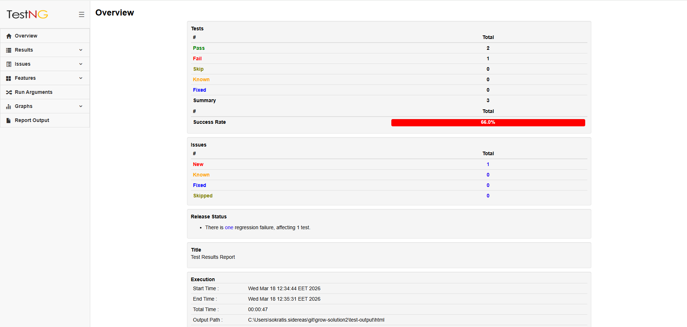
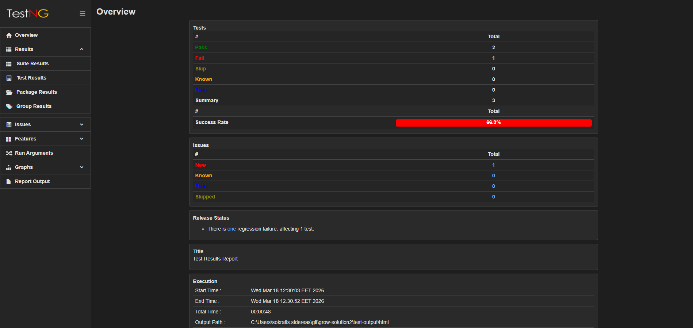
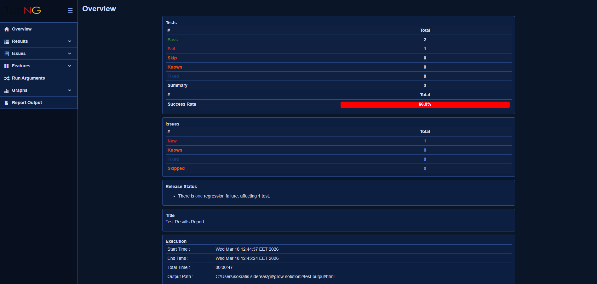

##  ReportNG  ##

An enhanced HTML/XML reporting plugin for the [TestNG](https://testng.org/) testing framework. ReportNG replaces TestNG's default reporting with a modern, feature-rich interface built on Bootstrap, with support for issue tracking, test categorization, interactive graphs, and multiple locales.

 
[](https://img.shields.io/maven-central/v/com.github.sdrss/reportng) 
[](https://github.com/sdrss/reportNG/workflows/Java_CI/badge.svg)

<div style="display:flex; gap:16px;">
  <div style="text-align:center; width:30%"><br/><b>White</b></div>
  <div style="text-align:center; width:30%"><br/><b>Dark</b></div>
  <div style="text-align:center; width:30%"><br/><b>Blue</b></div>
</div>

[Sample report](https://sdrss.github.io/test/) / [Releases](https://github.com/sdrss/reportNG/releases) / [Wiki](https://github.com/sdrss/reportNG/wiki/) / [Maven Repository](https://mvnrepository.com/artifact/com.github.sdrss/reportng)

---

## Features

- Modern HTML reports styled with Bootstrap
- Interactive charts for test execution results (pass/fail/skip trends)
- Test categorization: **Regression** vs **New Feature** tests
- Issue tracking: **Known Defects**, **Fixed Issues**, **New Issues**, **Skipped Issues**
- JUnit-compatible XML output
- Fail-fast listener (stops on first non-known failure)
- Configurable test retry support
- Configurable timeouts per test
- Multi-locale support: English, French, Portuguese
- Package-level test summary view
- Detailed per-test log output pages
- Dark, white, and blue report themes (switchable via system property)

---

## Requirements

- Java 11+
- Maven 3.x
- TestNG 7.x

---
 

### Configure via System Properties

Pass these as JVM arguments (e.g., `-Dproperty=value`) or in your Maven plugin configuration:

| Property | Default | Description |
|---|---|---|
| `org.uncommons.reportng.title` | `Test Results` | Report title |
| `org.uncommons.reportng.knownDefectsMode` | `false` | Enable known defects tracking |
| `org.uncommons.reportng.escape-output` | `true` | Escape HTML in log output |
| `org.uncommons.reportng.logOutputReport` | `false` | Generate separate log output pages |
| `org.uncommons.reportng.locale` | system default | Report locale (e.g. `en_US`, `fr_FR`, `pt_PT`) |
| `org.uncommons.reportng.timeout` | none | Global test timeout in milliseconds |
| `org.uncommons.reportng.maxRetryCount` | `0` | Number of retries for failed tests |
| `org.uncommons.reportng.skip.execution` | `false` | Skip remaining tests on suite failure |
| `org.uncommons.reportng.show-passed-configuration-methods` | `false` | Show passed `@Before`/`@After` methods |
| `org.uncommons.reportng.show-suite-configuration-methods` | `false` | Show suite-level configuration methods |
| `org.uncommons.reportng.show-regression-column` | `false` | Show regression column in results table |
| `org.uncommons.reportng.debug.mode` | `false` | Enable debug logging |
| `org.uncommons.reportng.externalLinks` | none | JSON map of label → URL for external links |
| `org.uncommons.reportng.theme` | `white` | Report color theme: `white`, `dark`, or `blue` |

* org.uncommons.reportng.escape-output : Used to turn off escaping for log output in the reports (not recommended). The default is for output to be escaped, since this prevents characters such as '<' and '&' from causing mark-up problems. If escaping is turned off, then log text is included as raw HTML/XML, which allows for the insertion of hyperlinks and other nasty hacks.
 * org.uncommons.reportng.title : Used to over-ride the report title.
 * org.uncommons.reportng.show-passed-configuration-methods : Set to "true" or "false" to specify whether the pass Configuration methods (@BeforeClass,@AfterClass etc.) should be included in test output. Failures are reported by default always.
 * org.uncommons.reportng.knownDefectsMode : Set to "true" to specify if failed tests with @KnownDefect are marked as Known and pass tests with @KnownDefect are marked as Fixed. Otherwise if "false" then failed tests with @KnownDefect are marked as normally failed.
 * org.uncommons.reportng.logOutputReport : Set to "true" or "false" to specify if a summary of log output is generated and linked in test report.
 * org.uncommons.reportng.locale
Over-rides the default locale for localised messages in generated reports. If not specified, the JVM default locale is used. If there are no translations available for the selected locale the default English messages are used instead. This property should be set to an ISO language code (e.g. "en" or "fr") or to an ISO language code and an ISO country code separated by an underscore (e.g. "en_US" or "fr_CA").
 * org.uncommons.reportng.skip.execution : Set to "true" whenever you need to skip the rest testNG execution.See for more [Wiki/Tips](https://github.com/sdrss/reportNG/wiki/Tips)
 * org.uncommons.reportng.show-suite-configuration-methods : Set to "true" to display @Before & @After suite methods into overview page. Otherwise, if false then suite configuration methods are displayed by default in the first/last test. Default value is false
 * org.uncommons.reportng.show-regression-column : Set to "true"/"false" in order to show/hide accordingly the column Regression into Overview page. The default value is false
 * org.uncommons.reportng.theme : Set to `"dark"`, `"white"`, or `"blue"` to control the report color theme. The default value is `white`. When set to `dark`, the report uses a dark background; when set to `blue`, the report uses a deep navy background with adjusted colors for all status indicators, tables, and navigation.

---

## Report Output

After test execution, reports are written to `test-output/`:

```
test-output/
├── html/
│   ├── index.html          # Main report entry point
│   ├── overview.html       # Summary dashboard
│   ├── results.html        # Detailed test results
│   ├── groups.html         # Results by group
│   ├── packages.html       # Results by package
│   ├── regression.html     # Regression test summary
│   ├── newFeatures.html    # New feature test summary
│   ├── newIssues.html      # Newly failing tests
│   ├── knownIssues.html    # Tests with known defects
│   ├── fixedIssues.html    # Previously failing tests now passing
│   └── ...                 # Charts, logs, suite pages
└── xml/
    └── *.xml               # JUnit-compatible XML per test class
```

Open `test-output/html/index.html` in a browser to view the report.

---

## Result Statuses

| Status | Description |
|---|---|
| `PASS` | Test passed |
| `FAIL` | Test failed |
| `SKIP` | Test was skipped |
| `PASS_WITH_KNOWN_ISSUES` | Test passed but is marked `@KnownDefect` |
| `PASS_WITH_FIXED_ISSUES` | Test marked `@KnownDefect` now passes cleanly |

---
 
 ## How to use ReportNG ##
 
 To use the reporting plug-in, set the listeners attribute of the testng element. The class names for the ReportNG reporters are:

    org.uncommons.reportng.HTMLReporter
    org.uncommons.reportng.JUnitXMLReporter
 You may also want to disable the default TestNG reporters by setting the useDefaultListeners attribute to "false".

 ## Usage of @KnownDefect

    import org.uncommons.reportng.annotations.KnownDefect;
    
    @KnownDefect(description="Jira Ticket XXXX")
    @Test(description = "Test1")
    public void test1() throws Exception {
        /*Test Code that eventually will produce an Exception*/
	     new Exception("Assert Error");
    }
    
  By enabling the "org.uncommons.reportng.knownDefectsMode" the above test will be marked as Known Defect.
  If test doesn't throw any Exception then the test will be marked as Fixed.
    
 ## Usage of @Feature
 
    import org.uncommons.reportng.annotations.Feature;
    
    @Feature(description = "This is a Feature")
    public class Test1 {
    	@Test(description = "Test1")
    	public void test1() throws Exception {
		/*Test Code*/
	}
    }
     
   Test Classes with @Feature will be reported as Regression tests.
     
  ## Usage of @NewFeature
    
    import org.uncommons.reportng.annotations.NewFeature;
     
    @NewFeature(description = "This is a new Feature")
    public class Test1 {
    	
	@Test(description = "Test1")
	public void test1() throws Exception {
        	/*Test Code*/
	}
    }
     
   Test Classes with @NewFeature will be reported as new Features tests.

  ## Usage of Skip Execution
   At any point but it’s advisable to be the first case in suite xml, you can set this system variable to "true" and skip the rest of  test execution, for example :
   	
	@Test(description = "In case of a failure Skip Execution")
	public void testLoginPage() throws Exception {
	try{
		loginToMyTestEnv();
	}catch(Exception ex){
		System.setProperty("org.uncommons.reportng.skip.execution","true");
		throw ex;
	}
	}
    
  By enabling this system property all of the rest testNG tests will be skipped and the generated report will have on overview page the root cause of the failure providing the message "Skip Execution due to Skip Execution Mode".
  Alternative you can use this system property in your TestListener and Skip test execution on the first failure. This will work as Fail Fast Mode. See [Wiki](https://github.com/sdrss/reportNG/wiki) for example.

 ## Usage of embedded listeners
  ReportNG has available to use some extra testNG listeners. Currently a "Fail Fast", a "Test Retry" & the "Test Time Out" Listener.
   To enable them you need to set the listeners attributes of the testng element. 
  For fail fast mode : 

	org.uncommons.reportng.listeners.FailFastListener
   
  For timeout and retry test : 
  
    org.uncommons.reportng.listeners.Retry
    org.uncommons.reportng.listeners.IAnnotationTransformerListener
  
  Both required and both can be parameterized as concerns the timeout and the max retries by system properties,  accordingly : 
    
    System.setProperty("org.uncommons.reportng.timeout", "6000");
    System.setProperty("org.uncommons.reportng.maxRetryCount", "2");
 
 Timeout is in milliseconds , in case of 0 the listener is not invoked.
 
 MaxRetryCount is the maximum number of retries until test is pass, in case of 0 again the listener is not invoked.
  
 ## Mvn dependency : 
      
      <dependency>
	   <groupId>com.github.sdrss</groupId>
	   <artifactId>reportng</artifactId>
	   <version>3.0.0</version>
      </dependency>

